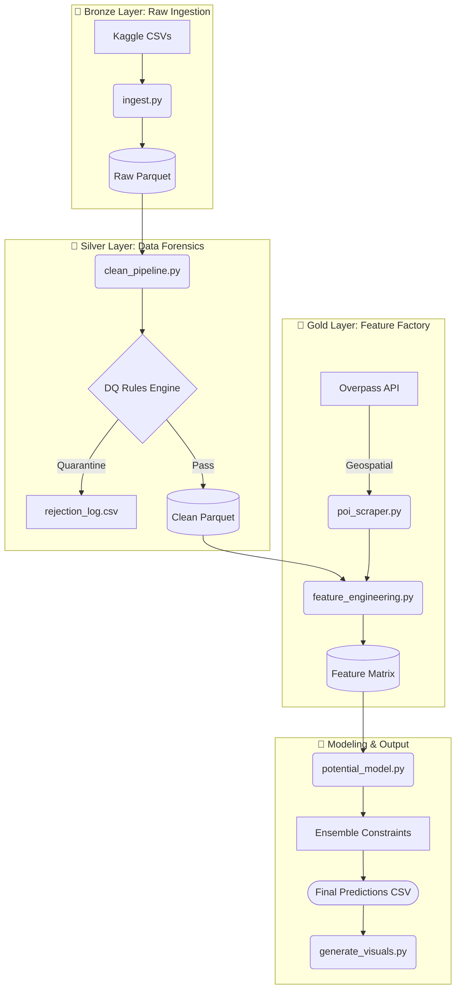

<div align="center">
  
# 🌩️ Data Storm 7.0: Project Beverage Potential
**Advanced Latent Demand Prediction Engine for Traditional Trade Outlets**

[](https://www.python.org/downloads/release/python-3100/)
[](https://pandas.pydata.org/)
[](https://python-visualization.github.io/folium/)
[](https://databricks.com/glossary/medallion-architecture)
[]()

*Engineered for OCTAVE (John Keells Group) by Team CODE BLOODED*

</div>

---

## 📖 Executive Summary
Traditional historical sales data answers the question: *"What did this outlet sell?"* Our mission was to answer a fundamentally different question: **"What *could* this outlet sell if supply chain constraints were removed?"**

This repository contains an end-to-end Machine Learning and Data Engineering pipeline designed to predict the **Maximum Monthly Purchase Potential (in liters)** for 20,000 Sri Lankan retail outlets for January 2026. By treating historical sales as a left-censored demand problem, we engineered a system that identifies suppressed demand using peer benchmarking, geographic foot-traffic density, and algorithmic growth modeling.

---

## 🏗️ System Architecture (The Medallion Lakehouse)

We implemented a robust, enterprise-grade data pipeline utilizing the Medallion Architecture pattern to ensure data hygiene, reproducibility, and high-performance processing via `.parquet` columnar storage.


## 🚀 Key Innovations & "New Gen" Features

### 1. 🛡️ Data Quality (DQ) Forensics Engine
We do not silently drop data. The Silver Layer contains a strict rules engine that processes over **2.37 million rows**, routing anomalies (e.g., GPS coordinates located in the ocean, physically impossible volume metrics) into a secure quarantine log for business auditing. 

### 2. 🌍 Geospatial Intelligence Integration
Sales do not happen in a vacuum. Our `poi_scraper.py` dynamically queries the OpenStreetMap Overpass API to scan radial zones (300m to 2km) around every single outlet. By detecting the density of schools, hospitals, and transit hubs, the model dynamically boosts demand ceilings for high-foot-traffic locations.

### 3. 📉 Constraint & Plateau Classification
The feature matrix mathematically profiles every outlet's historical behavior into three distinct stages:
* **SUPPLY_CONSTRAINED:** Flat volume with low order frequency. (High latent potential)
* **DEMAND_LIMITED:** Actively growing but approaching natural physical limits.
* **GROWTH_STAGE:** New or highly volatile outlets requiring peer-benchmarked baselines.

### 4. ⚖️ Strict Business Guardrails
Mathematical models can hallucinate impossible targets. We coded strict physical capacity caps directly into the prediction engine (e.g., capping 'Kade' outlets at 5,000L and 'Grocery' stores at 15,000L) to ensure 100% physically actionable business deliverables.

---

## 🛠️ Installation & Quick Start

**1. Clone the Repository & Install Dependencies**
```bash
git clone https://github.com/NimnaOfficial/BaveragePotential.git
cd BaveragePotential
pip install -r requirements.txt
```
### 2. Populate the Lakehouse
Ensure your downloaded Kaggle datasets are placed inside the `data/bronze/` directory:
* `transactions_history_final.csv`
* `outlet_master.csv`
* `outlet_coordinates.csv`
* `distributor_seasonality_details.csv`
* `holiday_list.csv`

### 3. Execute the Pipeline Sequence
Run the modular pipeline in terminal. The pipeline is designed to be fully idempotent.

```bash
# Phase 1: Ingest CSV to Parquet
python src/bronze/ingest.py                  

# Phase 2: Run Data Forensics & Cleaning
python src/silver/clean_pipeline.py          

# Phase 3: Gather Geographic Intelligence (Optional)
python src/gold/poi_scraper.py               

# Phase 4: Build the Unified Feature Matrix
python src/gold/feature_engineering.py       

# Phase 5: Execute Latent Demand Engine
python src/modeling/potential_model.py 

# Phase 6: Generate Executive Visuals
python src/modeling/generate_visuals.py
```
## 📂 Repository Directory Structure

```plaintext
📦 project-root
 ┣ 📂 data
 ┃ ┣ 📂 bronze          # Raw CSV inputs and initial Parquet conversions
 ┃ ┣ 📂 silver
 ┃ ┃ ┣ 📂 cleaned       # Validated datasets passing all DQ rules
 ┃ ┃ ┗ 📂 rejected      # Quarantined anomaly logs (rejection_log.csv)
 ┃ ┣ 📂 gold            # Final aggregated feature matrices
 ┃ ┗ 📂 poi_cache       # Local JSON cache for Overpass API requests
 ┣ 📂 src
 ┃ ┣ 📂 bronze          # Ingestion scripts
 ┃ ┣ 📂 silver          # DQ rule definitions and cleaning pipeline
 ┃ ┣ 📂 gold            # Feature engineering and POI scraping logic
 ┃ ┗ 📂 modeling        # ML prediction engine and visual generation
 ┣ 📂 outputs
 ┃ ┣ 📂 visuals         # Heatmaps and constraint distribution charts
 ┃ ┗ 📜 [TEAM_NAME]_predictions.csv  # The final submission file
 ┣ 📜 .gitignore        # Shields GitHub from multi-gigabyte data files
 ┣ 📜 requirements.txt  # Python environment dependencies
 ┗ 📜 README.md         # You are here
```

---

## 👥 Meet the Engineering Team

* **Dulan Dhanush** — Lead Data Engineer & Pipeline Architect
  * *Focus: Medallion architecture layout, Pandas memory optimization, Data forensics.*
* **K.G.L. Sandanimne** — Lead Data Scientist & Modeler
  * *Focus: Geospatial API integration, Algorithmic constraint profiling, Feature engineering.*
* **Huwin Fernando** - AI Prompt Engineer
  * *Focus: Handling AI agents and prompt creating.*

> *"Transforming raw historical constraints into actionable future potential."*
